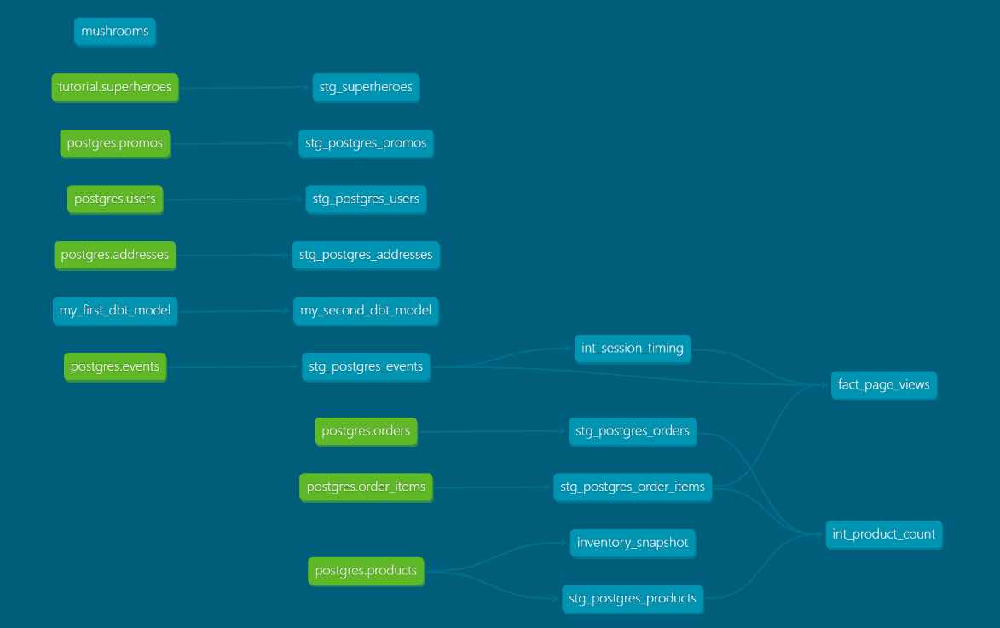

Part 1. Models 

We were approached by the marketing team to answer some questions about Greenery’s users! Use your staging models you created in Week 1 to answer their questions:

What is our user repeat rate? 
Repeat Rate = Users who purchased 2 or more times / users who purchased
0.798387

```
WITH UserPurchaseCounts AS (
    SELECT 
        USER_ID, 
        COUNT(DISTINCT ORDER_ID) AS purchase_count
    FROM DEV_DB.DBT_FANCHENGLOBALPCOM.STG_POSTGRES_ORDERS
    GROUP BY USER_ID
)
SELECT 
 sum((purchase_count < 2) ::int) as have_less_two_purchase,
 sum((purchase_count >= 2) ::int) as have_two_plus_purchase,
 count(user_id) as num_users,
 div0(have_two_plus_purchase,num_users) as repeat_rate
FROM 
    UserPurchaseCounts
```

What are good indicators of a user who will likely purchase again? What about indicators of users who are likely NOT to purchase again? If you had more data, what features would you want to look into to answer this question?
NOTE: This is a hypothetical question vs. something we can analyze in our Greenery data set. Think about what exploratory analysis you would do to approach this question.

indicators would be how many time they purchased within a time frame?
loyal user should purchase more than 2 within a month, and bad user woule be one purchase and last purchase date is 30 day away from today.
we might want to know how much money they spend?
```
```


Explain the product mart models you added. Why did you organize the models in the way you did?
added pageview, this one will have product events date for analysis, it contains each user stayed on each session by prodct. BI tool can easily aggregate them and do analysis on top of it.

```
```
Use the dbt docs to visualize your model DAGs to ensure the model layers make sense

Paste in an image of your DAG from the docs. These commands will help you see the full DAG
$ dbt docs generate 
$ dbt docs serve --no-browser



Part 2. Tests 

We added some more models and transformed some data! Now we need to make sure they’re accurately reflecting the data. Add dbt tests into your dbt project on your existing models from Week 1, and new models from the section above

What assumptions are you making about each model? (i.e. why are you adding each test?)
all the id of each model should not be null and unique.
price of product and cost of a order should be positive value.
```
```

Did you find any “bad” data as you added and ran tests on your models? How did you go about either cleaning the data in the dbt model or adjusting your assumptions/tests?
Not for greenery but in superhero there some weights not positive value, I follow the target folder and paste the code to snowflake to see which record is bad.
```
```

Your stakeholders at Greenery want to understand the state of the data each day. Explain how you would ensure these tests are passing regularly and how you would alert stakeholders about bad data getting through.
use dbt buld to make sure all the test are being passed, set up alerts in dbt cloud
```
```


Part 3. dbt Snapshots
Let's update our products snapshot that we created last week to see how our data is changing:
Run the product snapshot model using dbt snapshot and query it in snowflake to see how the data has changed since last week. 
Which products had their inventory change from week 1 to week 2? 

Pothos
Philodendron
Monstera
String of pearls